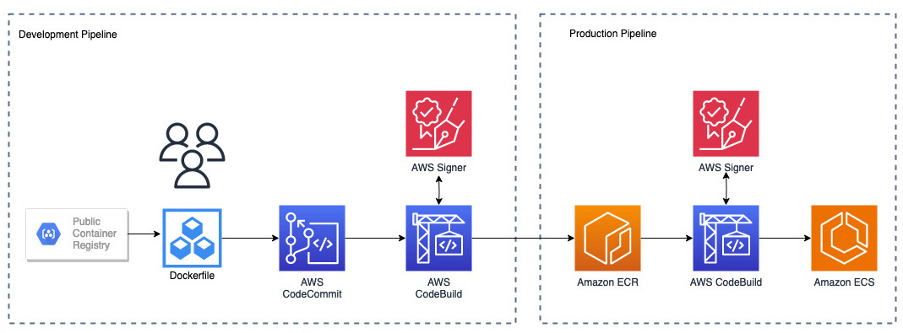

# AWS CDK OCI Artifact Signing project
This project is used to demonstrate how OCI artifacts can be signed and verified in a developement pipeline.

Important: this application uses various AWS services and there are costs associated with these services after the Free Tier usage - please see the [AWS Pricing page](https://aws.amazon.com/pricing/) for details. You are responsible for any AWS costs incurred. No warranty is implied in this example.
<h3 align="center">
  <a href="#requirements">Requirements</a> •
  <a href="#reference-architecture">Architecture</a> •
  <a href="#installation-instructions">Installation</a> •
  <a href="#cleanup">Cleanup</a> •
  <a href="#security">Security</a> •
  <a href="#license">License</a>
</h3>


---

## Requirements

* An AWS Account
* AWS CLI already configured with appropriate permissions to build and deploy [CDK](https://docs.aws.amazon.com/cdk/v2/guide/getting_started.html)
* [NodeJS 14.x installed](https://nodejs.org/en/download/)
* [AWS Cloud Development Kit (AWS CDK) v2 installed](https://docs.aws.amazon.com/cdk/v2/guide/getting_started.html) *minimum version 2.87*.

## Reference Architecture



## Installation Instructions

1. Clone the repo onto your local development machine:
```
git clone https://github.com/aws-samples/aws-signer-oci-artifacts
```

2. Change into the cloned directed with `cd aws-signer-oci-artifacts` and install the dependencies via `npm install`

3. Deploy the CDK application via `cdk deploy`. During the following prompt, `Do you wish to deploy these changes (y/n)?`, enter *y*, to enable the infrastructure to deployed.

## Cleanup

1. Navigate to the [ECR repository](console.aws.amazon.com/ecr/repositories) which should be named *signer-workflow-ecr* and delete all the artifacts.

2. Destroy the CDK application:
```sh
cdk destroy
```

If you have any questions, please contact the author or raise an issue in the GitHub repo.

## Security

See [CONTRIBUTING](CONTRIBUTING.md#security-issue-notifications) for more information.

## License

This library is licensed under the MIT-0 License. See the LICENSE file.


